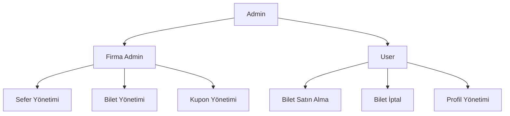

# 🚌 DviceBilet - Otobüs Bileti Satış Platformu

<div align="center">


[](https://php.net)
[](https://sqlite.org)
[](https://docker.com)
[](LICENSE)

**Otobüs bileti satış sistemi**

### 🎯 Temel Özellikler Özeti

🚌 **Sefer Yönetimi** • 🪑 **Koltuk Seçimi** • 🎫 **Kupon Sistemi** • 💰 **Sanal Kredi** • 🖼️ **Logo Yükleme** • 📄 **PDF Bilet** • 🔐 **Güvenlik** • 🌐 **Türkçe**


[🛠️ Kurulum](#-Kurulum) • [📋 Özellikler](#-özellikler) • [🐳 Docker](#-docker-kurulumu) 

</div>

---

## 📋 İçindekiler

- [🛠️ Kurulum](#️-kurulum)
- [✨ Özellikler](#-özellikler)
- [👥 Kullanıcı Rolleri](#-kullanıcı-rolleri)
- [DviceBilet Kurulum Kılavuzu](#-Dvicebilet-kurulum-kılavuzu)
- [📦 Veritabanı Kurulumu](#-veritabanı-kurulumu)
- [🔑 Test Hesapları](#-test-hesapları)
- [📱 Sayfa Yapısı](#-sayfa-yapısı)
- [🔐 Güvenlik Özellikleri](#-güvenlik-özellikleri)
- [🚀 Kullanım Rehberi](#-kullanım-rehberi)


---

## ✨ Özellikler

### 🎯 Ana Özellikler

| Özellik | Açıklama | Durum |
|---------|----------|-------|
| 🚌 **Sefer Arama** | Kalkış-varış şehri ve tarih seçimi | ✅ |
| 🪑 **Koltuk Seçimi** | Görsel koltuk haritası, dinamik kapasite | ✅ |
| 🎫 **Kupon Sistemi** | Global ve firma özel kuponlar | ✅ |
| 💰 **Sanal Kredi** | 1000 TL başlangıç bakiyesi | ✅ |
| ❌ **Bilet İptal** | 1 saat kuralı ile iptal sistemi | ✅ |
| 📄 **PDF Bilet** | bilet indirme | ✅ |
| 🔐 **Yetki Kontrolü** | Role-based access control | ✅ |
| 🎨 **Modern Tema** | Modern tema | ✅ |
| 📱 **Responsive** | Mobil uyumlu arayüz | ✅ |
| 🐳 **Docker** | Containerized deployment | ✅ |

### 🔥 Gelişmiş Özellikler

| Özellik | Açıklama | Durum |
|---------|----------|-------|
| 🏢 **Multi-Company** | Çoklu firma desteği | ✅ |
| 👨‍💼 **Admin Panel** | Kapsamlı yönetim paneli | ✅ |
| 🚌 **Company Panel** | Firma yönetim paneli | ✅ |
| 📊 **İstatistikler** | Detaylı raporlama | ✅ |
| 🔄 **Real-time** | Canlı veri güncellemeleri | ✅ |
| 🛡️ **Security** | Kapsamlı güvenlik önlemleri | ✅ |
| 🌍 **Timezone** | Türkiye saat dilimi desteği | ✅ |
| 💾 **Backup** | Otomatik veritabanı yedekleme | ✅ |
| 🖼️ **Logo Upload** | PNG logo yükleme sistemi | ✅ |
| 📸 **Image Preview** | Canlı logo önizleme | ✅ |
| 🌐 **Türkçe Dil** | Tam Türkçe arayüz ve yorumlar | ✅ |
| 📝 **Profile Management** | Kullanıcı profil yönetimi | ✅ |

### 🌟 Öne Çıkan Özellikler Detayı

#### 🖼️ Logo Yönetim Sistemi
Modern ve güvenli firma logo yönetimi:
- **Dosya Formatı:** Sadece PNG (yüksek kalite ve şeffaflık desteği)
- **Boyut Limiti:** Maksimum 2MB (performans optimizasyonu)
- **Önizleme:** Gerçek zamanlı logo önizleme
- **Temizlik:** Eski dosyaların otomatik silinmesi
- **İsimlendirme:** Benzersiz dosya isimleri (conflict önleme)

#### 🎫 Gelişmiş Kupon Sistemi
Esnek ve güçlü indirim yönetimi:
- **Kupon Tipleri:**
  - Global Kuponlar (tüm firmalar için)
  - Firma Özel Kuponlar (sadece belirli firma)
- **İndirim Türleri:**
  - Yüzde İndirim (%10, %20, vb.)
  - Sabit Tutar İndirim (50 TL, 100 TL, vb.)
- **Kısıtlamalar:**
  - Minimum sepet tutarı
  - Maksimum kullanım sayısı
  - Son kullanma tarihi
  - Kullanıcı başına kullanım limiti

#### 🪑 Dinamik Koltuk Sistemi
Esnek koltuk yönetimi:
- **Dinamik Kapasite:** Firma bazlı kapasite ayarı
- **Görsel Harita:** İnteraktif koltuk seçimi
- **Real-time Güncelleme:** Anlık rezervasyon durumu
- **Multi-seat:** Tek seferde 5 koltuğa kadar seçim

#### ❌ Akıllı İptal Sistemi
Kullanıcı dostu iptal politikası:
- **1 Saat Kuralı:** Kalkıştan 1 saat öncesine kadar iptal
- **Otomatik İade:** Tam tutar bakiyeye iade
- **Durum Takibi:** Gerçek zamanlı iptal durumu

#### 📄 PDF Bilet Sistemi
Profesyonel bilet tasarımı:
- **Firma Logosu:** Dinamik logo yerleştirme
- **Türkçe Karakter:** UTF-8 desteği
- **Responsive PDF:** Mobil uyumlu tasarım

#### 💰 Sanal Kredi Sistemi
Güvenli ödeme altyapısı:
- **Başlangıç Bakiyesi:** 1000 TL
- **Admin Yüklemesi:** Manuel bakiye ekleme
- **Otomatik Kesinti:** Bilet alımında otomatik
- **İade Sistemi:** İptal durumunda otomatik iade
- **Bakiye Görüntüleme:** Her sayfada bakiye gösterimi

---

## 👥 Kullanıcı Rolleri

### 🔑 Rol Hiyerarşisi



### 👨‍💼 Admin (Sistem Yöneticisi)
- **Yetkiler:**
  - ✅ Tüm firmaları yönetme (CRUD işlemleri)
  - ✅ **Firma logo yükleme ve güncelleme**
  - ✅ Firma adminlerini yönetme
  - ✅ Global kupon oluşturma ve düzenleme
  - ✅ Sistem istatistikleri görüntüleme
  - ✅ Kullanıcı bakiye yönetimi
  - ✅ Bilet sorgulama ve görüntüleme
  - ✅ Tüm sistem verilerine erişim
- **Erişim:** `admin_panel.php`
- **Test Hesabı:** `admin@dvice.com` / `admin123`

### 🚌 Firma Admin (Otobüs Firması Yetkilisi)
- **Yetkiler:**
  - Kendi firmasının seferlerini yönetme
  - Bilet yönetimi ve iptal
  - Firma özel kupon oluşturma
  - Gelir takibi
  - Koltuk kapasitesi yönetimi
- **Erişim:** `company_panel.php`
- **Test Hesapları:**
  - Metro: `metro@dvice.com` / `deneme123`
  - Ulusoy: `ulusoy@dvice.com` / `deneme123`

### 👤 User (Yolcu)
- **Yetkiler:**
  - Sefer arama ve bilet satın alma
  - Koltuk seçimi (max 5 koltuk)
  - Kupon kullanma
  - Bilet iptal (1 saat kuralı)
  - PDF bilet indirme
  - Profil yönetimi
- **Erişim:** Tüm kullanıcı sayfaları
- **Test Hesabı:** `yolcu@dvice.com` / `test123`

---

## 🛠️ Kurulum


### 📋 Gereksinimler

| Bileşen | Minimum | Önerilen |
|---------|---------|----------|
| **PHP** | 8.0+ | 8.2+ |
| **SQLite** | 3.x | 3.35+ |
| **Web Server** | Apache 2.4+ | Apache 2.4+ / Nginx 1.18+ |
| **Memory** | 256MB | 512MB+ |
| **Storage** | 100MB | 1GB+ |


# 📦 DviceBilet Kurulum Kılavuzu

Bu kılavuz, DviceBilet projesini Docker ile çalıştırmak için gereken adımları içerir.

## 🚀 Hızlı Başlangıç (3 Adımda)

### 1️⃣ Docker Desktop'ı Kurun

**Windows:**
1. [Docker Desktop for Windows](https://www.docker.com/products/docker-desktop) indirin
2. İndirilen `.exe` dosyasını çalıştırın
3. Kurulum tamamlandıktan sonra bilgisayarı yeniden başlatın
4. Docker Desktop'ı açın ve başlamasını bekleyin

**macOS:**
1. [Docker Desktop for Mac](https://www.docker.com/products/docker-desktop) indirin
2. `.dmg` dosyasını açın ve Docker'ı Applications klasörüne sürükleyin
3. Docker Desktop'ı başlatın


### 2️⃣ Projeyi İndirin

**GitHub'dan klonlayın:**
```bash
git clone https://github.com/dvicewashere/bilet-satin-alma.git
cd dvice_bilet
```

**veya ZIP olarak indirin:**
1. GitHub sayfasında "Code" butonuna tıklayın
2. "Download ZIP" seçeneğini seçin
3. ZIP dosyasını çıkarın
4. Klasöre terminal/komut satırından girin

### 3️⃣ Projeyi Çalıştırın

dockeri açın genellikle wsl güncel olmadığından ilk olarak aşağıdaki komutu çalıştırın

```bash
cmd admin: wsl --update
```

daha sonra docker açıldığında "engine starting" ifadesini görülür.

dockerı yapılandırmak için ilgili klasör içinde cmd çalıştırıp:

```bash
docker-compose up -d --build
```

komutunu çalıştırırız.


### 4️⃣ Tarayıcıdan Erişin

Tarayıcınızda şu adresi açın:
```
http://localhost:8080

```

## 📦 Veritabanı Kurulumu
```bash
# setup_bus_system.php
dosyası proje için gerekli veritabanı tablolarını oluşturur ve test hesaplarını otomatik olarak aktif hale getirir. Kurulumu başlatmak için tarayıcı üzerinden bu dosyayı çalıştırmanız yeterlidir

```
```

## ✅ Kurulum Tamamlandı!

Tebrikler! DviceBilet sistemi artık çalışıyor. 

İyi kullanımlar! Muhammed Harun ŞEKER 🎉


## 🛑 Projeyi Durdurma

```bash
# Container'ları durdurun (veriler korunur)
docker-compose -f docker-compose.dev.yml stop

# Container'ları tamamen kaldırın (veriler korunur)
docker-compose -f docker-compose.dev.yml down

# Her şeyi temizleyin (veriler dahil)
docker-compose -f docker-compose.dev.yml down -v
rm bus_tickets.db
```


## 💡 İpuçları

1. **İlk çalıştırma uzun sürer:** Docker image'ları indirilir (5-10 dakika)
2. **Sonraki başlatmalar hızlıdır:** Image'lar zaten mevcut olacak
3. **Kod değişiklikleri otomatik yansır:** Container'ı yeniden başlatmaya gerek yok
4. **Veritabanı kalıcıdır:** Container'ı silseniz bile `bus_tickets.db` dosyası korunur


## 🔑 Test Hesapları

### 👨‍💼 Admin Hesapları

| Rol | E-posta | Şifre | Açıklama |
|-----|---------|-------|----------|
| **Admin** | `admin@dvice.com` | `admin123` | Sistem yöneticisi |

### 🚌 Firma Admin Hesapları

| Firma | E-posta | Şifre | Açıklama |
|-------|---------|-------|----------|
| **Metro Turizm** | `metro@dvice.com` | `deneme123` | Metro Turizm yöneticisi |
| **Ulusoy Turizm** | `ulusoy@dvice.com` | `deneme123` | Ulusoy Turizm yöneticisi |
| **Varan Turizm** | `varan@dvice.com` | `deneme123` | Varan Turizm yöneticisi |
| **Pamukkale Turizm** | `pamukkale@dvice.com` | `deneme123` | Pamukkale Turizm yöneticisi |

### 👤 Kullanıcı Hesapları

| E-posta | Şifre | Bakiye | Açıklama |
|---------|-------|--------|----------|
| `yolcu@dvice.com` | `test123` | 1000 TL | Demo kullanıcısı |


## 📱 Sayfa Yapısı

### 🏠 Ana Sayfalar

| Sayfa | URL | Açıklama | Erişim |
|-------|-----|----------|--------|
| **Ana Sayfa** | `index.php` | Sefer arama formu | Herkese açık |
| **Giriş** | `login_bus.php` | Kullanıcı girişi | Herkese açık |
| **Kayıt** | `register_bus.php` | Kullanıcı kaydı | Herkese açık |

### 👤 Kullanıcı Sayfaları

| Sayfa | URL | Açıklama | Erişim |
|-------|-----|----------|--------|
| **Biletlerim** | `my_tickets.php` | Kullanıcının biletleri | User |
| **Sefer Detayları** | `trip_details.php` | Koltuk seçimi ve satın alma | Herkese açık |
| **Bilet Detayları** | `ticket_details.php` | Bilet bilgileri ve PDF | User |
| **Profil** | `profile.php` | Profil yönetimi | User |
| **Arama Sonuçları** | `search_results.php` | Sefer arama sonuçları | Herkese açık |
| **Hakkımızda** | `about.php` | Şirket bilgileri | Herkese açık |
| **İletişim** | `contact.php` | İletişim formu | Herkese açık |

### 👨‍💼 Yönetim Panelleri

| Sayfa | URL | Açıklama | Erişim |
|-------|-----|----------|--------|
| **Admin Panel** | `admin_panel.php` | Sistem yönetimi | Admin |
| **Firma Panel** | `company_panel.php` | Firma yönetimi | Firma Admin |
| **Admin Bilet Detayları** | `admin_ticket_details.php` | Bilet sorgulama | Admin |

### 🔧 Yardımcı Sayfalar

| Sayfa | URL | Açıklama | Erişim |
|-------|-----|----------|--------|
| **Bilet İptal** | `cancel_ticket.php` | Bilet iptal işlemi | User/Firma Admin |
| **PDF İndirme** | `download_ticket.php` | Bilet PDF indirme | User |
| **Çıkış** | `logout.php` | Oturum sonlandırma | Giriş yapmış kullanıcılar |


---


### 📁 Dosya Yapısı

```
dvice/
├── 📁 css/
│   └── style.css                 # Ana CSS dosyası 
├── 📁 images/
│   └── logos/                    # Firma logo dosyaları
│       ├── company_*.png         # Yüklenen firma logoları
│       ├── metro.png             # Örnek logolar
│       ├── ulusoy.png
│       ├── varan.png
│       └── pamukkale.png

├── 📄 config.php                 # Konfigürasyon ve veritabanı
├── 📄 index.php                  # Ana sayfa yönlendirme
├── 📄 index_bus.php              # Ana sayfa (sefer arama)
├── 📄 login_bus.php              # Giriş sayfası (animasyonlu)
├── 📄 register_bus.php           # Kayıt sayfası (animasyonlu)
├── 📄 my_tickets.php             # Biletlerim
├── 📄 trip_details.php           # Sefer detayları & koltuk seçimi
├── 📄 ticket_details.php         # Bilet detayları
├── 📄 search_results.php         # Arama sonuçları
├── 📄 profile.php                # Profil yönetimi
├── 📄 about.php                  # Hakkımızda
├── 📄 contact.php                # İletişim
├── 📄 faq.php                    # Sık Sorulan Sorular
├── 📄 terms.php                  # Kullanım Şartları
├── 📄 privacy.php                # Gizlilik Politikası
├── 📄 admin_panel.php            # Admin paneli (logo yükleme)
├── 📄 company_panel.php          # Firma paneli
├── 📄 admin_ticket_details.php   # Admin bilet detayları
├── 📄 cancel_ticket.php          # Bilet iptal
├── 📄 download_ticket.php        # PDF indirme (DOMPDF)
├── 📄 logout.php                 # Çıkış
├── 📄 setup_bus_system.php       # Sistem kurulumu
├── 📄 database_bus_tickets.sql   # Veritabanı şeması
├── 📄 favicon.svg                # Site favicon
├── 📄 Dockerfile                 # Docker yapılandırması
├── 📄 docker-compose.yml         # Docker Compose (production)
├── 📄 docker-compose.dev.yml     # Docker Compose (development)
├── 📄 .dockerignore              # Docker ignore dosyası
└── 📄 README.md                  # Bu dosya
```


## 🚀 Kullanım Rehberi

### 👤 Kullanıcı İşlemleri

#### 1. 🚌 Sefer Arama ve Bilet Satın Alma

**Adım 1: Sefer Arama**
1. Ana sayfaya gidin (`index_bus.php`)
2. Kalkış şehri seçin
3. Varış şehri seçin
4. Tarih seçin
5. "Sefer Ara" butonuna tıklayın

**Adım 2: Sefer Seçimi**
1. Arama sonuçlarından istediğiniz seferi seçin
2. "Detayları Gör" butonuna tıklayın

**Adım 3: Koltuk Seçimi**
1. Koltuk haritasından koltuklarınızı seçin (max 5 koltuk)
2. Seçilen koltuklar yeşil renkte görünür
3. "Seçimi Onayla" butonuna tıklayın

**Adım 4: Kupon Uygulama (Opsiyonel)**
1. Kupon kodu girin
2. "Kupon Uygula" butonuna tıklayın
3. İndirim miktarını kontrol edin

**Adım 5: Ödeme**
1. Toplam tutarı kontrol edin
2. "Bilet Satın Al" butonuna tıklayın
3. Sanal kredi ile ödeme yapın

#### 2. 🎫 Bilet Yönetimi

**Biletlerimi Görüntüleme:**
1. `my_tickets.php` sayfasına gidin
2. Aktif biletlerinizi görüntüleyin
3. Bilet detaylarını inceleyin

**PDF Bilet İndirme:**
1. Bilet detayları sayfasına gidin
2. "PDF İndir" butonuna tıklayın
3. Biletinizi PDF olarak indirin

**Bilet İptal:**
1. İptal etmek istediğiniz biletin yanındaki "İptal Et" butonuna tıklayın
2. İptal onayını verin
3. **Not:** Kalkış saatinden 1 saat önce iptal edilebilir

#### 3. 👤 Profil Yönetimi

**Profil Bilgilerini Güncelleme:**
1. `profile.php` sayfasına gidin
2. Bilgilerinizi güncelleyin
3. "Güncelle" butonuna tıklayın

### 👨‍💼 Admin İşlemleri

#### 1. 🏢 Firma Yönetimi

**Firma Ekleme:**
1. Admin paneline gidin (`admin_panel.php`)
2. "Firma Yönetimi" bölümüne gidin
3. Firma adını girin
4. **Logo yükleme:**
   - "Logo Dosyası" alanından PNG dosyası seçin
   - Maksimum boyut: 2MB
   - Sadece PNG formatı kabul edilir
   - Seçilen logo otomatik önizlenir
5. "Firma Ekle" butonuna tıklayın

**Firma Düzenleme:**
1. Düzenlemek istediğiniz firmanın yanındaki "Düzenle" butonuna tıklayın
2. Modal açılır ve mevcut logo gösterilir
3. Firma adını güncelleyebilirsiniz
4. **Logo değiştirme:**
   - "Yeni Logo Dosyası" alanından yeni PNG seçin
   - Yeni logo seçmezseniz mevcut logo korunur
   - Yeni logo seçildiğinde önizleme güncellenir
   - Eski logo otomatik silinir
5. "Güncelle" butonuna tıklayın

**Firma Silme:**
1. Silmek istediğiniz firmanın yanındaki "Sil" butonuna tıklayın
2. Silme onayını verin
3. **Not:** Aktif seferleri olan firmalar silinemez

#### 2. 👥 Firma Admin Yönetimi

**Firma Admin Ekleme:**
1. "Firma Admin Yönetimi" bölümüne gidin
2. "Yeni Admin Ekle" butonuna tıklayın
3. Admin bilgilerini doldurun
4. Firma seçin
5. "Admin Ekle" butonuna tıklayın

#### 3. 🎫 Global Kupon Yönetimi

**Global Kupon Oluşturma:**
1. "Global Kupon Yönetimi" bölümüne gidin
2. Kupon bilgilerini doldurun
3. "Kupon Oluştur" butonuna tıklayın

**Kupon Düzenleme:**
1. Düzenlemek istediğiniz kuponun yanındaki "Düzenle" butonuna tıklayın
2. Bilgileri güncelleyin
3. "Güncelle" butonuna tıklayın

#### 4. 💰 Bakiye Yönetimi

**Kullanıcı Bakiyesi Ekleme:**
1. "Bakiye Yönetimi" bölümüne gidin
2. Kullanıcı e-postasını girin
3. Eklenecek miktarı girin
4. "Bakiye Ekle" butonuna tıklayın

#### 5. 🔍 Bilet Sorgulama

**Bilet Detayları Sorgulama:**
1. "Bilet Sorgulama" bölümüne gidin
2. Bilet numarasını girin
3. "Sorgula" butonuna tıklayın
4. Bilet detaylarını görüntüleyin

### 🚌 Firma Admin İşlemleri

#### 1. 🚌 Sefer Yönetimi

**Sefer Ekleme:**
1. Firma paneline gidin (`company_panel.php`)
2. "Sefer Yönetimi" bölümüne gidin
3. "Yeni Sefer Ekle" butonuna tıklayın
4. Sefer bilgilerini doldurun
5. "Sefer Ekle" butonuna tıklayın

**Sefer Düzenleme:**
1. Düzenlemek istediğiniz seferin yanındaki "Düzenle" butonuna tıklayın
2. Bilgileri güncelleyin
3. "Güncelle" butonuna tıklayın

**Sefer Silme:**
1. Silmek istediğiniz seferin yanındaki "Sil" butonuna tıklayın
2. Silme onayını verin
3. **Not:** Aktif biletleri olan seferler silinemez

#### 2. 🎫 Bilet Yönetimi

**Bilet Görüntüleme:**
1. "Bilet Yönetimi" bölümüne gidin
2. Satılan biletleri görüntüleyin
3. Bilet detaylarını inceleyin

**Bilet İptal:**
1. İptal etmek istediğiniz biletin yanındaki "İptal Et" butonuna tıklayın
2. İptal onayını verin
3. **Not:** Kalkış saatinden 1 saat önce iptal edilebilir

#### 3. 🎫 Firma Kupon Yönetimi

**Firma Kuponu Oluşturma:**
1. "Kupon Yönetimi" bölümüne gidin
2. Kupon bilgilerini doldurun
3. "Kupon Oluştur" butonuna tıklayın

**Kupon Düzenleme:**
1. Düzenlemek istediğiniz kuponun yanındaki "Düzenle" butonuna tıklayın
2. Bilgileri güncelleyin
3. "Güncelle" butonuna tıklayın

#### 4. 📊 İstatistikler

**Gelir Takibi:**
1. "İstatistikler" bölümüne gidin
2. Toplam geliri görüntüleyin
3. Sefer bazında gelirleri inceleyin

---


## 🎯 Özellik Listesi

### ✅ Tamamlanan Özellikler

#### 🏗️ **Temel Özellikler**
- [x] Kullanıcı rolleri (Admin, Firma Admin, User)
- [x] Sefer arama ve filtreleme
- [x] Koltuk seçimi (max 5 koltuk)
- [x] Kupon sistemi (global ve firma özel)
- [x] Bilet satın alma
- [x] Bilet iptal (1 saat kuralı)
- [x] PDF bilet indirme
- [x] Sanal kredi sistemi (1000 TL başlangıç)

#### 🎨 **UI/UX Özellikleri**
- [x] Modern AMOLED tema
- [x] Responsive tasarım
- [x] Gradient renkler
- [x] Hover animasyonları
- [x] Loading durumları
- [x] Error handling
- [x] Success mesajları

#### 🔐 **Güvenlik Özellikleri**
- [x] SQL Injection koruması
- [x] XSS koruması
- [x] CSRF koruması
- [x] Session güvenliği
- [x] Role-based access control
- [x] Input validation
- [x] Output encoding

#### 👨‍💼 **Admin Özellikleri**
- [x] Firma yönetimi (CRUD işlemleri)
- [x] **Logo yönetim sistemi**
  - [x] PNG formatında logo yükleme
  - [x] Maksimum 2MB dosya boyutu kontrolü
  - [x] Otomatik dosya adı oluşturma (uniqid)
  - [x] Canlı logo önizleme
  - [x] Eski logo otomatik temizleme
  - [x] Frontend ve backend doğrulama
- [x] Firma admin yönetimi
- [x] Global kupon yönetimi
- [x] Bakiye yönetimi
- [x] Bilet sorgulama
- [x] Sistem istatistikleri
- [x] Modal düzenleme
- [x] **Türkçe kod yorumları** (Tüm PHP dosyalarında)

#### 🚌 **Firma Admin Özellikleri**
- [x] Sefer yönetimi
- [x] Bilet yönetimi
- [x] Firma kupon yönetimi
- [x] Gelir takibi
- [x] Koltuk kapasitesi yönetimi
- [x] Bilet iptal
- [x] PDF indirme


### 💎 Premium Özellikler

- ✅ **Animasyonlu Giriş/Kayıt:** Sevimli avatar animasyonu
- ✅ **Gradient Tema:** Modern AMOLED siyah-kırmızı tema
- ✅ **Modal Windows:** Smooth modal açılış/kapanış
- ✅ **Scroll Restoration:** Sayfa geçişlerinde scroll pozisyonu korunur
- ✅ **Loading States:** Kullanıcı geri bildirimleri
- ✅ **Error Handling:** Detaylı hata mesajları
- ✅ **Success Messages:** Başarılı işlem bildirimleri
- ✅ **Responsive Tables:** Mobil uyumlu tablolar
- ✅ **Auto-complete:** Şehir seçiminde otomatik tamamlama
- ✅ **Date Picker:** Modern tarih seçici
- ✅ **File Preview:** Dosya yükleme önizlemesi
- ✅ **Drag & Drop:** Logo sürükle-bırak 

### 🔧 Teknik Üstünlükler

**Performans:**
- ⚡ < 2 saniye sayfa yükleme
- 🚀 Optimize edilmiş SQL sorguları
- 💾 Efficient memory kullanımı
- 📊 Database indexing
- 🔄 Session optimization

**Güvenlik:**
- 🛡️ SQL Injection koruması
- 🔒 XSS koruması
- 🔐 CSRF koruması
- 📁 Secure file upload
- 🔑 Password hashing (bcrypt)
- 👤 Role-based access control


**⭐ Projeyi beğendiyseniz yıldızlamayı unutmayın!**


</div>


